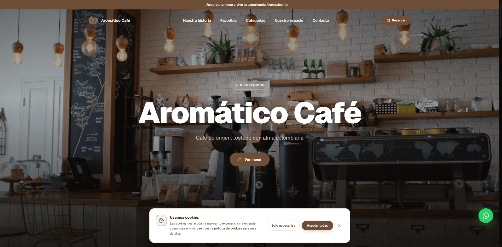

# Aromático Café

> Complete operations platform for a coffee shop — public landing, offline-capable point of sale, and a multi-role admin panel on a Supabase backend.


<p align="center">
  
</p>

**Live demo:** https://aromaticocafe-demo.vercel.app/

---

## What is it

An integrated platform for a coffee shop in Colombia. Three connected surfaces that share the same backend:

- **Public landing** — where customers book a table, browse the menu and apply for a job.
- **Point of sale** — the cashier's daily tool, built to keep working when the WiFi drops.
- **Admin panel** — where the owner runs inventory, sales, accounting, staff and more.

Everything is driven from a single Supabase backend with row-level security and real-time sync between devices.

---

## Features

### 🏠 Public landing
Customer-facing page, fully editable from the admin panel.

- **Online reservations** with WhatsApp confirmation, persisted in the database
- **Category-filtered menu** with live search
- **Featured products** curated from the admin
- **Weekly promotions** with automatic validity labels ("Ends today", "Until June 15")
- **Photo gallery** of the venue with an autoplay carousel
- **Public job board** with open positions and an application form
- **Legal pages** (Terms, Privacy, Cookies) auto-filled with the business data
- **Cookie consent banner** with acceptance and revocation
- **Configurable announcement bar** with a call-to-action
- **Responsive layout** that scales fluidly across screen sizes

### 🛒 Point of sale (Caja)
Cashier interface designed to work offline.

- **Cart** with quantities, per-item options, discounts and applied promotions
- **Parked orders** so a sale isn't lost when an urgent customer arrives
- **Multiple payment methods** (cash, card, transfer) with change calculation
- **Cash register open/close** with denomination counting
- **Cash movements** (deposits and withdrawals) during the shift
- **Loyalty** by stamps or points, configurable
- **Offline mode** with a sync queue stored on the device
- **Receipt** with business data and the cashier's name

### 🗂️ Admin panel
Management center for the owner and manager.

- **Dashboard** with day / week / month KPIs and charts
- **Inventory**: products, categories, real-time stock, movements and costs
- **Reservations** with status flow, zones, tables and a daily calendar view
- **Sales history** with filters, search, partial refunds and voids
- **Customers & loyalty** with phone-based lookup
- **Workers**: onboarding, shifts, attendance, performance, payroll and granular permissions
- **Job applications** with workflow states, internal notes and bulk actions
- **Open positions** the owner activates and configures
- **Suppliers & purchases** that update stock, cost and expenses in one operation
- **Accounting** with the daily cash register lifecycle, transactions and payroll
- **Reports** exportable to Excel and PDF
- **Bulk import** of spreadsheets with a preview before applying
- **Settings**: business data, currency, taxes, loyalty and opening hours
- **Appearance**: colors, fonts, hero, gallery, navigation and floating buttons

---

## Technical highlights

- **Row-Level Security** on every table, with sensitive mutations behind atomic SQL functions
- **Real-time sync** between devices without polling
- **Offline-first POS** with a sync queue in the browser (IndexedDB)
- **Dynamic theming** (light / dark) editable from the admin
- **Legal compliance** (Colombian Law 1581/2012): Terms, Privacy, Cookies and consent banner
- **Route-based code splitting** with `React.lazy()` to keep the initial bundle small
- **Accessibility** via Radix UI primitives, keyboard navigation and focus management
- **Installable PWA** with a Service Worker

---

## Stack

| Layer | Technology |
|---|---|
| Frontend | Vite, React 19, TypeScript |
| Routing | React Router 7 (lazy routes) |
| Server state | TanStack React Query 5 + Supabase Realtime |
| UI state | Zustand 5 |
| Forms | React Hook Form 7 |
| Styling | Tailwind CSS 4, shadcn/ui (Radix UI) |
| Animations | Framer Motion 12 |
| Icons | Lucide React |
| Charts | Recharts 3 |
| Backend | Supabase (Postgres, Auth, Storage, Realtime) |
| Reports | xlsx + jsPDF |
| PWA / offline | vite-plugin-pwa + localforage |
| Tooling | ESLint 9, typescript-eslint 8 |

---

## Getting started

```bash
git clone https://github.com/S4nti4goCoder/aromaticocafe.git
cd aromaticocafe
npm install

# Set up the environment variables
cp .env.example .env.local
# Edit .env.local with your Supabase credentials

npm run dev
```

> **Note:** This repository contains the frontend application only. The database
> schema, SQL functions and seed data are not included, as they hold
> client-specific business logic.

---

## Environment variables

Variables prefixed with `VITE_` are exposed to the browser (safe for the client).

| Variable | Purpose |
|---|---|
| `VITE_SUPABASE_URL` | Supabase project URL |
| `VITE_SUPABASE_ANON_KEY` | Anonymous key (safe for the frontend) |
| `SUPABASE_PROJECT_ID` | Project id, used only by the `gen:types` script (not bundled) |

See `.env.example` for reference.

---

## Scripts

| Command | Description |
|---|---|
| `npm run dev` | Start the dev server |
| `npm run build` | Production build (type-check + bundle) |
| `npm run preview` | Serve the production build locally |
| `npm run lint` | Run ESLint over the project |
| `npm run gen:types` | Regenerate TypeScript types from the Supabase schema |

---

## Project structure

```
src/
├── features/          # One folder per domain
│   ├── landing/       # Public landing + menu & reservation modals
│   ├── auth/          # Login and password change
│   ├── dashboard/     # KPIs and charts
│   ├── caja/          # Point of sale
│   ├── inventory/     # Categories, products, stock, promotions
│   ├── reservations/  # Reservations, tables, calendar
│   ├── sales/         # Sales history, refunds and voids
│   ├── customers/     # Customers and loyalty
│   ├── purchases/     # Purchases and suppliers
│   ├── workers/       # Staff, shifts, attendance and payroll
│   ├── accounting/    # Accounting and cash register
│   ├── jobs/          # Applications and open positions
│   ├── legal/         # Terms, Privacy, Cookies
│   ├── settings/      # Settings and appearance
│   ├── profile/       # Current user's profile
│   ├── import/        # Bulk spreadsheet imports
│   └── errors/        # 404 and error pages
├── hooks/             # React Query hooks
├── lib/               # Utilities
├── components/        # shared + ui (shadcn)
├── routes/            # Routes and access guards
├── store/             # Zustand stores
├── providers/         # Theme, Auth
└── types/             # Generated + domain types
```

---

## Roles and permissions

| Role | Access |
|---|---|
| `super_admin` | Full access, including developer-only routes. The only role that can create other super_admins. |
| `gerente` (manager) | Everything except developer routes: customers, sales, purchases, table management, reservation confirmation, refunds, applications and open positions. |
| `cajero` (cashier) | Point of sale and reservations (list and calendar). No access to customers, sales history, purchases or table management. |
| `barista` | Per-module permissions (view / create / edit / delete) configured individually by the manager. |

Access is enforced on the client (to hide UI) and on the server with row-level security and `SECURITY DEFINER` functions.

---

## Author

Built by **Santiago Quintero**, full-stack developer.

[](https://santiagocoder.vercel.app/)
[](https://github.com/S4nti4goCoder)
